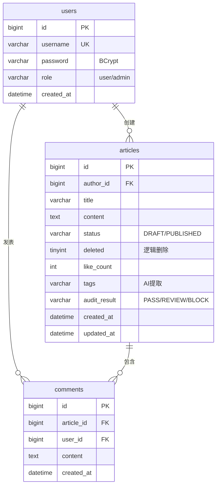

# 基于 AI 的智能知识库与内容发布平台

> **题目**: 题目三 — 具有 AI 能力的知乎式知识社区后台  
> **代码仓库**: github.com/EloimEssaim-74/java-webfinal  
> **分支**: stagefinal

---

## 封面与摘要

| 项目 | 内容 |
|------|------|
| **题目选择** | 题目三：智能知识库与内容发布平台 |
| **系统名称** | Knowledge Platform |
| **组员** | （请填写组员姓名与学号） |
| **分工** | （请填写每人分工） |
| **联系方式** | （请填写联系方式） |
| **代码仓库** | https://github.com/EloimEssaim-74/java-webfinal |

### 摘要（~500字）

Knowledge Platform 是一个基于 Spring Cloud 微服务架构的智能知识库与内容发布平台，实现了完整的用户认证、文章管理、互动评论、实时热搜榜单、异步消息处理和 AI 流式写作辅助等核心功能。

**技术栈**: Spring Boot 3.4.6 + Spring Cloud Gateway + Spring Cloud Alibaba + Nacos 2.2 + Sentinel + MyBatis-Plus 3.5.7 + MySQL 8.0 (主从) + Redis 7 + RabbitMQ 3 + Caffeine + Resilience4j + Docker Compose + React 18。

**核心技术点**: (1) Nginx + Sentinel 双层网关限流，支持 Nacos 动态规则热更新；(2) Redis ZSET 实现 O(log N) 热度排序，配合 Caffeine L1 本地缓存与 Pub/Sub 跨实例刷新；(3) RabbitMQ Topic Exchange 实现文章发布后标签提取与合规检测的并行异步处理；(4) Spring WebFlux + SSE 实现 AI 流式逐字续写，集成 Resilience4j 熔断降级；(5) MyBatis-Plus + Druid 实现读写分离路由与 SQL 防火墙。

**成果亮点**: JMeter 极限压测验证缓存层支持 1000 并发零失败（avg 2ms）、MySQL 层 200 并发零失败（avg 8ms）；代码审查发现并修复 16 个安全与功能缺陷；25 个 JUnit 自动化测试全部通过；交付 10 份技术文档（~7,000行）、9 份开发日志（Stage 5-14）、4 套 Postman 集合（50+用例）、3 套演示脚本。

---

## 一、业务背景与范围界定

### 1.1 业务场景

构建一个具有 AI 能力的知识社区后台，用户在平台上创作文章、浏览内容、互动交流，系统提供实时热搜排行和 AI 写作辅助。

### 1.2 核心用户角色与用例

| 角色 | 用例 | 说明 |
|------|------|------|
| **普通用户** | 注册/登录/注销 | JWT 认证，7天有效期，黑名单注销 |
| | 浏览文章 | 分页列表（降序）、文章详情 |
| | 创作文章 | 创建草稿 → 发布（触发异步处理） |
| | 修改/删除文章 | 仅限自己的文章，管理员可操作所有 |
| | 点赞/评论 | Redis SETNX 防重，异步持久化 |
| | 查看热搜 | Top 10 实时热度排行 |
| | AI 续写 | SSE 流式逐字推送 |
| **管理员** | 管理所有文章 | 可修改/删除任意文章 |
| | 访问管理接口 | `/admin/*` 路由鉴权 |

### 1.3 MVP 范围

**本地原型已实现**:
- 用户认证（注册/登录/JWT/注销/角色）
- 文章 CRUD（草稿/发布/逻辑删除/分页列表/详情）
- 互动（点赞防重/评论异步持久化）
- 实时热搜 Top 10（Redis ZSET + Caffeine + Pub/Sub）
- 异步广播（RabbitMQ → 标签提取 + 合规检测）
- AI 流式续写（SSE + Demo 模式 + 熔断）
- 网关安全（双层限流 + JWT 鉴权 + header 防伪造）
- MySQL 读写分离
- JMeter 压测验证

**非目标范围**:
- 真实 LLM API 对接（当前 Demo 模式）
- 全文检索（Elasticsearch）
- Kubernetes 部署
- OAuth 2.0 第三方登录

---

## 二、本地原型系统架构与数据流

### 2.1 微服务清单

| 服务 | 端口 | 职责 |
|------|------|------|
| gateway-service × 2 | 8080 | API 网关：路由、JWT 鉴权、Sentinel 限流、CORS |
| user-service | 9001 | 用户注册、登录、JWT 签发与注销 |
| article-service × 3 | 9002 | 文章 CRUD、发布事件、热搜管理 |
| interact-service | 9003 | 评论异步写入、点赞防重 |
| ai-assistant-service | 9012 | SSE 流式续写（WebFlux 响应式） |
| tag-extract-service | 9010 | RabbitMQ 消费者：标签提取 |
| compliance-service | 9011 | RabbitMQ 消费者：合规检测 |
| common | — | 公共实体、DTO、工具类、配置 |

### 2.2 中间件清单

| 中间件 | 版本 | 用途 |
|--------|------|------|
| Nginx | alpine | 反向代理、令牌桶限流、HTTP 缓存 |
| MySQL | 8.0 (主+从) | 持久化存储、读写分离 |
| Redis | 7-alpine | ZSET 热搜、Stream 削峰、Pub/Sub、Token 黑名单 |
| RabbitMQ | 3-management | Topic Exchange 消息广播 |
| Nacos | 2.2 | 服务注册、Sentinel 规则配置 |

### 2.3 部署拓扑

```
                    localhost:80
                         │
                    ┌────▼────┐
                    │  Nginx  │  反向代理 + 令牌桶限流
                    └────┬────┘
                         │
              ┌──────────┴──────────┐
              ▼                     ▼
        ┌──────────┐          ┌──────────┐
        │Gateway 1 │          │Gateway 2 │  JWT 鉴权 + Sentinel
        │  :8080   │          │  :8080   │
        └────┬─────┘          └────┬─────┘
             └────────┬───────────┘
                      │
      ┌───────┬───────┼───────┬──────────┐
      ▼       ▼       ▼       ▼          ▼
   user-svc article  interact  ai-svc  tag/compliance
   :9001   :9002×3   :9003    :9012    :9010/:9011
      │       │        │        │
      └───────┼────────┘        │
              │                 │
      ┌───────┼─────────┐       │
      ▼       ▼         ▼       │
    MySQL   Redis    RabbitMQ    │
    :3306   :6379    :5672       │
    :3307(从)                    │
```

### 2.4 核心流程时序图

#### 时序图 1: 文章发布 → 异步标签提取 + 合规检测

```
用户           Gateway       article-service    RabbitMQ      tag-extract     compliance     MySQL
 │                │                │               │               │              │            │
 │ PUT /publish   │                │               │               │              │            │
 │───────────────▶│                │               │               │              │            │
 │                │ JWT验证+传身份  │               │               │              │            │
 │                │───────────────▶│               │               │              │            │
 │                │                │ 检查权限       │               │              │            │
 │                │                │──▶ findById   │               │              │──────────▶│
 │                │                │◀── article    │               │              │◀──────────│
 │                │                │               │               │              │            │
 │                │                │ UPDATE status=PUBLISHED       │              │            │
 │                │                │──────────────────────────────────────────────────────────▶│
 │                │                │               │               │              │            │
 │                │                │ convertAndSend(article.publish)               │            │
 │                │                │──────────────▶│               │              │            │
 │  200 OK        │                │               │               │              │            │
 │◀───────────────│◀───────────────│               │               │              │            │
 │                │                │               │   fan-out     │              │            │
 │                │                │               │──────┬────────│              │            │
 │                │                │               │      │        ▼              │            │
 │                │                │               │      │   提取关键词           │            │
 │                │                │               │      │   UPDATE tags────────▶│            │
 │                │                │               │      │              │         │            │
 │                │                │               │      └──────────────│─────────│            │
 │                │                │               │                    ▼         │            │
 │                │                │               │               敏感词检测      │            │
 │                │                │               │               UPDATE audit──▶│            │
```

#### 时序图 2: SSE AI 流式续写

```
客户端         Nginx          Gateway        ai-assistant-service    OpenAI API
 │               │               │                    │                  │
 │ POST /ai/continue (SSE)       │                    │                  │
 │──────────────▶│               │                    │                  │
 │               │ buffering off │                    │                  │
 │               │ timeout 300s  │                    │                  │
 │               │──────────────▶│                    │                  │
 │               │               │ response-timeout   │                  │
 │               │               │ 300000             │                  │
 │               │               │───────────────────▶│                  │
 │               │               │                    │ POST /v1/chat   │
 │               │               │                    │ completions     │
 │               │               │                    │ stream=true     │
 │               │               │                    │────────────────▶│
 │               │               │                    │                 │
 │  data: 让我来为               │                    │ SSE data chunks │
 │◀──────────────│◀──────────────│◀───────────────────│◀────────────────│
 │  data: 你展                   │                    │                 │
 │◀──────────────│◀──────────────│◀───────────────────│◀────────────────│
 │  ... (51 chunks, 200ms each)  │                    │                 │
 │  data: [DONE]                 │                    │                 │
 │◀──────────────│◀──────────────│◀───────────────────│                 │
```

#### 时序图 3: 热搜热度更新与缓存刷新

```
用户          article-service      Redis              Caffeine        Pub/Sub
 │                │                  │                    │              │
 │ GET /article/1 │                  │                    │              │
 │───────────────▶│                  │                    │              │
 │                │ recordRead(1, 5) │                    │              │
 │                │─────────────────▶│                    │              │
 │                │ SETNX read:1:5    │                    │              │
 │                │ (TTL 300s)        │                    │              │
 │                │◀───── OK ────────│                    │              │
 │                │ ZINCRBY hot_articles 1 +1             │              │
 │                │─────────────────▶│                    │              │
 │                │ PUBLISH hot_articles:refresh "read:1"  │              │
 │                │──────────────────────────────────────▶│──────────────▶│
 │  200 OK        │                  │                    │              │
 │◀───────────────│                  │                    │  invalidate  │
 │                │                  │                    │◀─────────────│
 │                │                  │                    │  cache.clear │
 │                │                  │                    │              │
 │  GET /trending │                  │                    │              │
 │───────────────▶│ getTop10()       │                    │              │
 │                │─────────────────▶│ Caffeine.get("top10")             │
 │                │                  │──── cache miss ───▶│              │
 │                │ ZREVRANGE 0 9    │                    │              │
 │                │◀──── top10 ──────│                    │              │
 │                │ batch MySQL select (补齐元数据)        │              │
 │  Top10 JSON    │                  │  populate cache    │              │
 │◀───────────────│                  │──────────────────▶│              │
```

---

## 三、数据库设计与持久化策略

> 详见 `docs/deliverFiles/02-数据库设计与持久化策略.md`

### 3.1 ER 图



### 3.2 关键索引设计

| 索引 | 字段 | 用途 |
|------|------|------|
| `idx_status_deleted_created` | (status, deleted, created_at) | 文章列表主查询：覆盖过滤+排序 |
| `idx_author` | (author_id) | "我的文章"查询 |
| `idx_article` | (article_id) | 评论按文章聚合 |
| `idx_username` | (username) | 登录用户查找 |

### 3.3 读写分离

```java
// @Transactional(readOnly=true) → 从库
@Transactional(readOnly = true)
public PageResult<ArticleListItemVO> list(int page, int size) { ... }

// @Transactional → 主库
@Transactional
public ArticleVO create(ArticleCreateRequest req, Long authorId) { ... }
```

---

## 四、安全与网关策略

> 详见 `docs/deliverFiles/01-安全与网关策略.md`

### 4.1 三层安全防御

**第一层 — Nginx 令牌桶**: 读 100 req/s · 写 20 req/s · 单 IP 50 连接

**第二层 — Sentinel 动态限流**: user 100 QPS · article 50 QPS · interact 30 QPS · 规则 Nacos gRPC 热推送

**第三层 — JWT + 身份防伪造**: parseToken → Redis 黑名单 → **先剥离客户端 X-User-* 头** → 注入可信身份

### 4.2 代码审查发现并修复的安全漏洞

- 注册时 `"role":"admin"` 可自提管理员 → 强制 `role=user`
- `X-User-Id` 头可被客户端伪造 → 网关先 `headers.remove()` 再注入
- JWT 密钥硬编码在源码 → 改为 `System.getenv("JWT_SECRET")`
- CORS `*` + `allowCredentials(true)` → 限制 `localhost:*` + 明确 methods

---

## 五、缓存、消息与并发控制策略

> 详见 `docs/deliverFiles/03-缓存消息与并发控制策略.md`

### 5.1 Redis 使用

| 数据结构 | Key | 用途 |
|---------|-----|------|
| ZSET | `hot_articles` | 热搜排行，ZINCRBY O(log N)，每日衰减 ×0.9 |
| String | `read:article:{id}:user:{uid}` | 阅读去重，TTL 300s |
| String | `like:article:{id}:user:{uid}` | 点赞防重，SETNX 原子 |
| String | `token:blacklist:{token}` | Token 黑名单，TTL=剩余有效期 |
| Stream | `like:events` | 点赞异步持久化，消费者组 ACK |
| List | `comment:events` | 评论批量落库，@Scheduled 5s |
| Pub/Sub | `hot_articles:refresh` | 跨实例缓存刷新 |

### 5.2 RabbitMQ 拓扑

```
article.topic.exchange (Topic, durable)
    ├── article.tag.queue → TagExtractConsumer × 5
    └── article.compliance.queue → ComplianceCheckConsumer × 10
        路由键: article.publish → fan-out 双队列
```

### 5.3 并发保护

- **Redis**: SETNX 原子去重 · ZINCRBY 原子递增 · Stream 消费者组 at-least-once
- **DB**: `UPDATE SET like_count = like_count + 1` 原子 SQL · MyBatis-Plus 逻辑删除
- **应用**: Resilience4j 熔断 · Nacos 心跳调优 (3s/30s) · Druid SQL 防火墙
- **网关**: Nginx `proxy_next_upstream http_503` 容错重试

---

## 六、AI/LLM 集成设计

> 详见 `docs/deliverFiles/04-AI集成设计.md`

### 6.1 架构

```
curl → Nginx(不缓冲) → Gateway(300s超时) → WebFlux → OpenAI API(stream=true)
```

### 6.2 双模式设计

- **Demo 模式**（当前运行）: 8 句预设中文 · 200ms 逐字 · 零配置 · 51 个 data 块
- **真实模式**: `OPENAI_API_KEY=sk-xxx` 一键切换，任何 OpenAI 兼容 API

### 6.3 熔断保护

Resilience4j Circuit Breaker: 10 次滑动窗口 · 50% 失败率 → 30s 断路 · 降级返回"AI 服务暂时不可用"

### 6.4 大模型调用的生产级优化（演进方案）

1. **请求排队机制**: 使用 RabbitMQ 或 Redis List 对 AI 请求进行排队，控制并发调用数不超过 API 速率限制
2. **相似结果缓存**: 对相同/相似的上下文进行语义哈希 → Redis 缓存结果，TTL 5 分钟
3. **多模型降级**: 主模型（GPT-4）超限时自动降级到备用模型（GPT-3.5 / DeepSeek / 本地模型）
4. **Token 预算管理**: 按用户/租户分配每日 Token 配额，超过后返回友好提示
5. **流式缓冲**: 在网关层缓存 SSE 流，多个相同请求共享一个上游连接

---

## 七、实时通信设计

> 详见 `docs/deliverFiles/05-实时通信设计.md`

### SSE 长连接

- **协议**: HTTP/1.1 Server-Sent Events
- **心跳**: 15 秒 `:keepalive` 注释防超时
- **超时**: Nginx 300s · Gateway 300s · WebFlux Flux.timeout(120s)
- **连接池**: Reactor Netty 100 连接 · pending acquire 10s

### Redis Pub/Sub 缓存刷新

- 每次 ZSET 热度变更 → `PUBLISH hot_articles:refresh`
- 所有 article-service 实例订阅 → `cacheManager.invalidate()`
- 消息丢失容错: Caffeine TTL 1s 保证最终一致

---

## 八、技术选型依据与权衡

> 详见 `docs/deliverFiles/06-技术选型依据与权衡.md`

| 决策 | 选择 | 核心原因 |
|------|------|---------|
| 网关 | Spring Cloud Gateway | 响应式非阻塞，Sentinel 集成零配置 |
| 注册中心 | Nacos | 注册+配置一体，gRPC 热推送 |
| 限流 | Nginx + Sentinel | 双层防御，动态规则无需重启 |
| 缓存 | Redis ZSET + Caffeine | ZSET O(log N) 排行 + 本地缓存 99%命中率 |
| 消息 | RabbitMQ | Topic 灵活路由，管理 UI，低运维 |
| AI | SSE (非 WebSocket) | 单向流，HTTP 原生，代理友好 |

---

## 九、测试

> 详见 `docs/deliverFiles/07-测试报告.md`

### 9.1 Postman 集合

| 文件 | 说明 |
|------|------|
| `deploy/postman/stage1test.postman_collection.json` | 基础接口 |
| `deploy/postman/stage6-trending.postman_collection.json` | 热搜测试 |
| `deploy/postman/stage10-integration-test.postman_collection.json` | 集成测试 |
| `deploy/postman/stage12-integration-test.postman_collection.json` | 全覆盖（50+用例） |

**使用方式**: Postman → Import → 选择文件 → 设置 `base_url=http://localhost` → Run Collection

### 9.2 JMeter 性能压测

| 场景 | 1000 并发 | 800 并发 | 500 并发 | 200 并发 |
|------|-----------|----------|----------|----------|
| 热搜榜（缓存） | **100% · 2ms** | **100% · 2ms** | **100% · 2ms** | **100% · 3ms** |
| 文章列表（MySQL） | — | — | — | **100% · 8ms** |

**测试计划**: `deploy/jmeter/`，运行 `jmeter -n -t deploy/jmeter/trending-100.jmx`

### 9.3 JUnit 自动化测试

```
Tests run: 25, Failures: 0, Errors: 0
├── JwtUtilsTest         12 cases  (token 生成/解析/过期/角色)
├── UserServiceImplTest   5 cases  (注册/登录/错误密码/重复)
└── ArticleServiceTest    8 cases  (创建/发布/修改/越权/删除/分页)
```

运行: `mvn test`

---

## 十、生产环境演进方案

> 详见 `docs/deliverFiles/08-生产环境演进方案.md`

### 短期（已完成）
- ✅ Stage 14: JMeter 极限压测（1000 并发验证）
- ✅ 水平扩展 3 实例 docker-compose --scale
- ✅ Nacos 心跳调优 + Nginx 容错
- ✅ Spring Boot 3.2.6 → 3.4.6（EOL 修复）

### 中期 — 高可用
- K8s 迁移 + HPA 自动扩缩容
- MySQL 主从自动故障转移（MHA/Orchestrator）
- Redis Sentinel 哨兵模式
- RabbitMQ 镜像队列
- Prometheus + Grafana 全链路监控

### 长期 — 平台化
- Elasticsearch 全文检索
- Redis Cluster 分片
- Kafka 升级（>10K msg/s 场景）
- 多租户 + OAuth 2.0
- 真实 LLM 替换 Demo 模式

---

## 十一、AI 辅助设计开发总结

> 详见 `docs/deliverFiles/09-AI辅助设计开发总结.md`

本项目采用 AI 辅助开发模式（Claude Code CLI），14 个开发阶段中 AI 代码占比约 70%，估计节省开发时间 40-50%。

**四种协作模式**:
- **"AI 写、人审"** — 前端组件、文档、测试脚本
- **"人设计、AI 实现"** — 数据库表、MQ 拓扑、缓存策略
- **"人编码、AI 审查"** — 安全过滤器、核心业务逻辑
- **"AI 诊断、人修复"** — Bug 排查（Jackson2JsonMessageConverter 5分钟定位）

**关键经验**: AI 在实现层面出色，架构决策需人主导；代码审查中 AI 发现 15+ 个 Bug；文档生成效率提升 5x 以上。

---

## 附录：文件索引

| 类别 | 路径 |
|------|------|
| 源码 | `backend/` (8 微服务) + `frontend/` (React SPA) |
| Docker | `docker-compose.yml` |
| 数据库 | `deploy/sql/init.sql` |
| Nginx | `deploy/nginx/nginx.conf` |
| Postman | `deploy/postman/` |
| JMeter | `deploy/jmeter/` |
| 交付文档 | `docs/deliverFiles/` (00-09) |
| 开发日志 | `docs/开发日志/` (stage5-14) |
| PPT | `docs/ppt.html` |
| 讲稿 | `docs/PRESENTATION.md` · `docs/PRESENTATION-10min.md` |
| 演示脚本 | `scripts/demo.sh` · `scripts/quick-demo.sh` |
| 压测脚本 | `scripts/bench.sh` |
| 测试脚本 | `scripts/test.sh` |
| Swagger UI | `http://localhost/api/user/swagger-ui.html` (启动后) |
