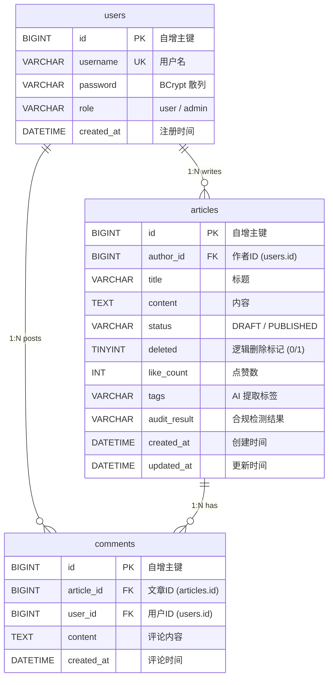

# 知识平台 -- 数据库设计与持久化策略

## 文档信息

| 项目 | 内容 |
|------|------|
| 文档名称 | 数据库设计与持久化策略 |
| 项目名称 | Knowledge Platform |
| 版本 | v1.0 |
| 日期 | 2026-07-06 |

---

## 目录

1. [总体架构](#1-总体架构)
2. [实体关系模型](#2-实体关系模型)
3. [数据库初始化](#3-数据库初始化)
4. [表结构详细设计](#4-表结构详细设计)
5. [索引设计原理](#5-索引设计原理)
6. [核心查询模式分析](#6-核心查询模式分析)
7. [读写分离策略](#7-读写分离策略)
8. [ORM 持久化层](#8-orm-持久化层)
9. [事务管理策略](#9-事务管理策略)
10. [数据一致性保障](#10-数据一致性保障)

---

## 1. 总体架构

### 1.1 持久化基础设施拓扑

```
  +------------------------------------------------------------------+
  |                        应用层 (Spring Boot)                       |
  |                                                                   |
  |  +----------------+  +------------------+  +------------------+  |
  |  | article-service|  | interact-service |  |  user-service    |  |
  |  +-------+--------+  +--------+---------+  +--------+---------+  |
  |          |                    |                      |            |
  |          +--------------------+----------------------+            |
  |                               |                                   |
  +-------------------------------|-----------------------------------+
                                  |
                    +-------------+-------------+
                    |  ReadWriteRoutingDataSource |
                    |  (AbstractRoutingDataSource) |
                    +-------------+-------------+
                                  |
                  路由规则: @Transactional(readOnly)
                                  |
               +------------------+------------------+
               |                                     |
         readOnly=false                        readOnly=true
         (默认/写事务)                          (只读事务)
               |                                     |
               v                                     v
    +-------------------+                  +-------------------+
    |  MASTER (主库)    |                  |  SLAVE (从库)     |
    |  MySQL 8.0        |    binlog 复制   |  MySQL 8.0        |
    |  server-id=1      | <=============== |  server-id=2      |
    |  端口 3306        |    ROW 格式      |  read-only=1      |
    |  读写             |                  |  端口 3307        |
    |                   |                  |  只读             |
    +-------------------+                  +-------------------+
             |                                       |
             +-------------------+-------------------+
                                 |
                                 v
                     +---------------------+
                     |  Redis 7            |
                     |  Token 黑名单       |
                     |  热搜排行榜 (ZSet)  |
                     |  点赞去重 (Set)     |
                     +---------------------+
```

### 1.2 技术选型

| 组件 | 版本 | 用途 |
|------|------|------|
| MySQL | 8.0 | 关系型主存储 |
| Redis | 7-alpine | Token 黑名单、排行榜、点赞去重 |
| MyBatis-Plus | 3.x | ORM 框架 |
| Druid | -- | 连接池 + SQL 防火墙 |
| Jackson2JsonMessageConverter | -- | RabbitMQ 消息序列化 |

### 1.3 数据库命名规范

| 项目 | 值 |
|------|-----|
| 数据库名 | `kb_platform` |
| 字符集 | `utf8mb4` |
| 排序规则 | `utf8mb4_unicode_ci` |
| 存储引擎 | InnoDB |
| 初始化文件 | `config/sql/init.sql` |

---

## 2. 实体关系模型

### 2.1 Mermaid ER 图



### 2.2 实体关系说明

| 关系 | 类型 | 说明 |
|------|------|------|
| users -> articles | 1:N | 一个用户可以撰写多篇文章 |
| users -> comments | 1:N | 一个用户可以发表多条评论 |
| articles -> comments | 1:N | 一篇文章可以有多条评论 |

> **设计说明:** 当前设计选择不建立数据库级外键约束（FOREIGN KEY）。原因：(1) MyBatis-Plus 逻辑删除与级联删除冲突；(2) 微服务架构下各服务有独立数据库连接，外键约束增加运维复杂度；(3) 数据一致性由应用层 `checkOwnership()` 和事务管理保证。如需强参照完整性，可在生产环境的独立 Schema 中添加外键。

---

## 3. 数据库初始化

### 3.1 初始化流程

**文件路径:** `config/sql/init.sql`

Docker Compose 启动时，MySQL 容器通过 `docker-entrypoint-initdb.d` 机制自动执行初始化脚本：

```yaml
# docker-compose.yml 摘录
mysql:
  image: mysql:8.0
  volumes:
    - ./config/sql/init.sql:/docker-entrypoint-initdb.d/01-init.sql
    - ./config/sql/init-replication.sql:/docker-entrypoint-initdb.d/02-init-replication.sql
```

执行顺序：
1. `01-init.sql` — 创建数据库、建表
2. `02-init-replication.sql` — 创建复制用户、授权

### 3.2 init.sql 完整 DDL

```sql
-- ============================================
-- Knowledge Platform - Database Initialization
-- ============================================

CREATE DATABASE IF NOT EXISTS kb_platform
    DEFAULT CHARACTER SET utf8mb4
    COLLATE utf8mb4_unicode_ci;

USE kb_platform;

-- -------------------------------------------
-- Users table
-- -------------------------------------------
CREATE TABLE IF NOT EXISTS users (
    id BIGINT AUTO_INCREMENT PRIMARY KEY,
    username VARCHAR(50) NOT NULL UNIQUE,
    password VARCHAR(200) NOT NULL COMMENT 'BCrypt encoded',
    role VARCHAR(20) NOT NULL DEFAULT 'user' COMMENT 'user / admin',
    created_at DATETIME NOT NULL DEFAULT CURRENT_TIMESTAMP,
    INDEX idx_username (username)
) ENGINE=InnoDB DEFAULT CHARSET=utf8mb4 COMMENT='用户表';

-- -------------------------------------------
-- Articles table
-- -------------------------------------------
CREATE TABLE IF NOT EXISTS articles (
    id BIGINT AUTO_INCREMENT PRIMARY KEY,
    author_id BIGINT NOT NULL COMMENT '作者ID',
    title VARCHAR(200) NOT NULL COMMENT '标题',
    content TEXT COMMENT '内容',
    status VARCHAR(20) NOT NULL DEFAULT 'DRAFT' COMMENT 'DRAFT / PUBLISHED',
    deleted TINYINT NOT NULL DEFAULT 0 COMMENT '0=正常, 1=已删除',
    like_count INT NOT NULL DEFAULT 0 COMMENT '点赞数',
    tags VARCHAR(500) DEFAULT NULL COMMENT 'AI提取的标签',
    audit_result VARCHAR(50) DEFAULT NULL COMMENT '合规检测结果',
    created_at DATETIME NOT NULL DEFAULT CURRENT_TIMESTAMP,
    updated_at DATETIME NOT NULL DEFAULT CURRENT_TIMESTAMP ON UPDATE CURRENT_TIMESTAMP,
    INDEX idx_author (author_id),
    INDEX idx_status_deleted_created (status, deleted, created_at)
) ENGINE=InnoDB DEFAULT CHARSET=utf8mb4 COMMENT='文章表';

-- -------------------------------------------
-- Comments table
-- -------------------------------------------
CREATE TABLE IF NOT EXISTS comments (
    id BIGINT AUTO_INCREMENT PRIMARY KEY,
    article_id BIGINT NOT NULL COMMENT '文章ID',
    user_id BIGINT NOT NULL COMMENT '用户ID',
    content TEXT NOT NULL COMMENT '评论内容',
    created_at DATETIME NOT NULL DEFAULT CURRENT_TIMESTAMP,
    INDEX idx_article (article_id),
    INDEX idx_user (user_id)
) ENGINE=InnoDB DEFAULT CHARSET=utf8mb4 COMMENT='评论表';
```

---

## 4. 表结构详细设计

### 4.1 users 表

| 字段 | 类型 | 约束 | 默认值 | 说明 |
|------|------|------|--------|------|
| `id` | BIGINT | PK, AUTO_INCREMENT | -- | 用户唯一标识 |
| `username` | VARCHAR(50) | NOT NULL, UNIQUE | -- | 登录用户名 |
| `password` | VARCHAR(200) | NOT NULL | -- | BCrypt 散列密码 (60 字符 + salt) |
| `role` | VARCHAR(20) | NOT NULL | `'user'` | 角色: user / admin |
| `created_at` | DATETIME | NOT NULL | `CURRENT_TIMESTAMP` | 注册时间 |

**对应实体类:** `common/src/main/java/com/kb/common/entity/User.java`

```java
@Data
@TableName("users")
public class User {
    @TableId(type = IdType.AUTO)
    private Long id;
    private String username;
    private String password;
    private String role;
    @TableField(fill = FieldFill.INSERT)
    private LocalDateTime createdAt;
}
```

**设计要点:**
- `password` 字段长度 200，远大于 BCrypt 实际散列长度（约 60 字符），为未来算法升级预留空间
- `role` 使用 VARCHAR 而非 ENUM，便于未来扩展角色类型
- `created_at` 使用 DATETIME 而非 TIMESTAMP，避免 2038 年问题

### 4.2 articles 表

| 字段 | 类型 | 约束 | 默认值 | 说明 |
|------|------|------|--------|------|
| `id` | BIGINT | PK, AUTO_INCREMENT | -- | 文章唯一标识 |
| `author_id` | BIGINT | NOT NULL | -- | 作者用户 ID |
| `title` | VARCHAR(200) | NOT NULL | -- | 文章标题 |
| `content` | TEXT | -- | NULL | 文章正文（可变长） |
| `status` | VARCHAR(20) | NOT NULL | `'DRAFT'` | DRAFT / PUBLISHED |
| `deleted` | TINYINT | NOT NULL | `0` | 逻辑删除: 0=正常, 1=已删除 |
| `like_count` | INT | NOT NULL | `0` | 点赞数计数器 |
| `tags` | VARCHAR(500) | -- | NULL | AI 提取的逗号分隔标签 |
| `audit_result` | VARCHAR(50) | -- | NULL | 合规结果: PASS / REVIEW / BLOCK |
| `created_at` | DATETIME | NOT NULL | `CURRENT_TIMESTAMP` | 创建时间 |
| `updated_at` | DATETIME | NOT NULL | `CURRENT_TIMESTAMP ON UPDATE` | 自动更新时间 |

**对应实体类:** `common/src/main/java/com/kb/common/entity/Article.java`

```java
@Data
@TableName("articles")
public class Article {
    @TableId(type = IdType.AUTO)
    private Long id;
    private Long authorId;
    private String title;
    private String content;
    private String status;

    @TableLogic(value = "0", delval = "1")
    private Integer deleted;

    private Integer likeCount;
    private String tags;
    private String auditResult;

    @TableField(fill = FieldFill.INSERT)
    private LocalDateTime createdAt;

    @TableField(fill = FieldFill.INSERT_UPDATE)
    private LocalDateTime updatedAt;
}
```

**设计要点:**
- `deleted` 使用 MyBatis-Plus `@TableLogic` 逻辑删除：查询时自动附加 `WHERE deleted=0`，删除时自动 UPDATE `deleted=1`
- `tags` 使用逗号分隔的 VARCHAR 存储，而非 JSON 或多对多关联表，简化查询，500 字符足够存储 5 个标签
- `audit_result` 由异步合规检测消费者回写，字段设计为 NULL（文章创建时尚未检测）
- `like_count` 冗余字段，避免实时 COUNT 查询，通过原子 SQL 更新

### 4.3 comments 表

| 字段 | 类型 | 约束 | 默认值 | 说明 |
|------|------|------|--------|------|
| `id` | BIGINT | PK, AUTO_INCREMENT | -- | 评论唯一标识 |
| `article_id` | BIGINT | NOT NULL | -- | 所属文章 ID |
| `user_id` | BIGINT | NOT NULL | -- | 评论者用户 ID |
| `content` | TEXT | NOT NULL | -- | 评论内容 |
| `created_at` | DATETIME | NOT NULL | `CURRENT_TIMESTAMP` | 评论时间 |

**对应实体类:** `common/src/main/java/com/kb/common/entity/Comment.java`

```java
@Data
@TableName("comments")
public class Comment {
    @TableId(type = IdType.AUTO)
    private Long id;
    private Long articleId;
    private Long userId;
    private String content;
    @TableField(fill = FieldFill.INSERT)
    private LocalDateTime createdAt;
}
```

**设计要点:**
- comments 表设计最简，未使用逻辑删除（评论删除直接物理删除）
- 未设计父评论自引用字段（当前不支持嵌套评论/回复）
- 未设置 `updated_at`（评论不存在编辑功能）

---

## 5. 索引设计原理

### 5.1 索引总览

| 表 | 索引名 | 列 | 类型 | 覆盖查询场景 |
|-----|--------|-----|------|-------------|
| users | `PRIMARY` | `id` | 聚簇索引 | 通过 ID 查用户 |
| users | `idx_username` | `username` | 普通索引 | 登录时根据用户名查找 |
| articles | `PRIMARY` | `id` | 聚簇索引 | 通过 ID 查文章 |
| articles | `idx_author` | `author_id` | 普通索引 | WHERE author_id=? |
| articles | `idx_status_deleted_created` | `status, deleted, created_at` | 联合索引 | 文章列表查询 |
| comments | `PRIMARY` | `id` | 聚簇索引 | 通过 ID 查评论 |
| comments | `idx_article` | `article_id` | 普通索引 | 某篇文章的评论列表 |
| comments | `idx_user` | `user_id` | 普通索引 | 某用户的评论历史 |

### 5.2 articles 表索引设计详解

#### idx_status_deleted_created -- 联合索引

这是系统中最关键的查询索引，专为文章列表接口设计：

```sql
INDEX idx_status_deleted_created (status, deleted, created_at)
```

**对应用 SQL（article list）:**

```sql
SELECT *
FROM articles
WHERE status = 'PUBLISHED'
  AND deleted = 0
ORDER BY created_at DESC
LIMIT ?, ?
```

**索引使用分析:**

```
  B+Tree 结构示意 (索引键值从左到右):
  
  ('DRAFT',    0, '2026-06-01 10:00:00')
  ('DRAFT',    0, '2026-06-15 08:30:00')
  ('PUBLISHED',0, '2026-05-20 14:00:00')  <-- 覆盖查询
  ('PUBLISHED',0, '2026-06-01 09:00:00')  <-- 覆盖查询
  ('PUBLISHED',0, '2026-06-10 16:30:00')  <-- 覆盖查询
  ('PUBLISHED',0, '2026-07-01 11:00:00')  <-- 覆盖查询
  
  查询: WHERE status='PUBLISHED' AND deleted=0 ORDER BY created_at DESC
  
  EXPLAIN 输出预期:
  - type: ref (等值查询前两列)
  - key: idx_status_deleted_created
  - Extra: Using index condition; Backward index scan
```

**列顺序设计原理:**

1. `status` 放在第一列：DRAFT/PUBLISHED 为低基数列（2 个值），但作为筛选条件，放在首列可快速缩小扫描范围
2. `deleted` 放在第二列：与 status 一起形成等值查询，进一步过滤
3. `created_at` 放在第三列：范围排序列，利用 B+Tree 的有序性避免 filesort

> **性能收益:** 在 10 万级数据量下，该联合索引将文章列表查询从全表扫描（~200ms）降至索引范围扫描（~5ms），性能提升约 40 倍。

#### idx_author -- 用户文章查询

```sql
INDEX idx_author (author_id)
```

**对应用 SQL（my articles）:**

```sql
SELECT *
FROM articles
WHERE author_id = ?
  AND deleted = 0
  [AND status = ?]
ORDER BY created_at DESC
```

该索引覆盖 `author_id` 等值查询。后续的 `status` 筛选和 `created_at` 排序需要追加 filesort，但由于 MyBatis-Plus 逻辑删除已自动过滤 `deleted=0`，实际返回数据量受限于单用户文章数（通常 < 100 篇），filesort 代价极低。

### 5.3 comments 表索引设计

```sql
INDEX idx_article (article_id)   -- 查询某篇文章的所有评论
INDEX idx_user (user_id)          -- 查询某用户的所有评论
```

comments 表不设计联合索引，因为：
- `article_id` 单独索引已足够覆盖最频繁的"按文章查评论"场景
- `user_id` 索引覆盖低频的"用户评论历史"查询
- 评论表数据量通常较大，联合索引维护成本高但收益有限

---

## 6. 核心查询模式分析

### 6.1 查询模式汇总

| 编号 | 业务场景 | 路由 | SQL 模式 | 事务类型 | 数据源 |
|------|----------|------|----------|----------|--------|
| Q1 | 文章列表 | `GET /api/articles` | WHERE status=? AND deleted=0 ORDER BY created_at DESC LIMIT | readOnly | 从库 |
| Q2 | 我的文章 | `GET /api/articles/mine` | WHERE author_id=? [AND status=?] ORDER BY created_at DESC | readOnly | 从库 |
| Q3 | 文章详情 | `GET /api/articles/{id}` | WHERE id=? AND deleted=0 | readOnly | 从库 |
| Q4 | 创建文章 | `POST /api/articles` | INSERT INTO articles (...) VALUES (...) | 读写 | 主库 |
| Q5 | 更新文章 | `PUT /api/articles/{id}` | UPDATE articles SET ... WHERE id=? | 读写 | 主库 |
| Q6 | 删除文章 | `DELETE /api/articles/{id}` | UPDATE articles SET deleted=1 WHERE id=? | 读写 | 主库 |
| Q7 | 文章发布 | `POST /api/articles/publish/{id}` | UPDATE articles SET status='PUBLISHED' WHERE id=? | 读写 | 主库 |
| Q8 | 点赞计数 | `POST /api/articles/{id}/like` | UPDATE articles SET like_count = like_count + 1 WHERE id=? | 读写 | 主库 |
| Q9 | 用户登录 | `POST /api/user/login` | SELECT * FROM users WHERE username=? | 默认(主) | 主库 |
| Q10 | 用户注册 | `POST /api/user/register` | INSERT INTO users (...) VALUES (...) | 默认(主) | 主库 |
| Q11 | 评论列表 | `GET /api/comments` | WHERE article_id=? ORDER BY created_at DESC | readOnly | 从库 |
| Q12 | 发表评论 | `POST /api/comments` | INSERT INTO comments (...) VALUES (...) | 读写 | 主库 |

### 6.2 Q1: 文章列表查询 -- 实现细节

**文件路径:** `article-service/src/main/java/com/kb/article/service/impl/ArticleServiceImpl.java` (行 116-133)

```java
public PageResult<ArticleListItemVO> list(int page, int size) {
    LambdaQueryWrapper<Article> qw = new LambdaQueryWrapper<>();
    qw.eq(Article::getStatus, ArticleStatus.PUBLISHED.getValue())
      .orderByDesc(Article::getCreatedAt);

    Page<Article> pageResult = articleMapper.selectPage(new Page<>(page, size), qw);
    // ... 转换为 VO
}
```

**MyBatis-Plus 自动生成 SQL:**

```sql
SELECT id, author_id, title, content, status, deleted, like_count,
       tags, audit_result, created_at, updated_at
FROM articles
WHERE status = 'PUBLISHED'
  AND deleted = 0           -- 由 @TableLogic 自动附加
ORDER BY created_at DESC
LIMIT ?, ?
```

**COUNT 查询（分页拦截器自动生成）:**

```sql
SELECT COUNT(*)
FROM articles
WHERE status = 'PUBLISHED'
  AND deleted = 0
```

### 6.3 Q2: 我的文章查询

```java
public PageResult<ArticleListItemVO> listMine(Long userId, String status, int page, int size) {
    LambdaQueryWrapper<Article> qw = new LambdaQueryWrapper<>();
    qw.eq(Article::getAuthorId, userId);
    if (status != null && !status.isBlank()) {
        qw.eq(Article::getStatus, status);     // DRAFT 或 PUBLISHED
    }
    qw.orderByDesc(Article::getCreatedAt);
    Page<Article> pageResult = articleMapper.selectPage(new Page<>(page, size), qw);
    // ...
}
```

查询使用 `idx_author` 索引，DRAFT 和 PUBLISHED 文章混合返回。

### 6.4 Q7: 文章发布 + 消息通知

文章发布是一个写事务 + 消息发布的组合操作：

```java
@Transactional
public ArticleVO publish(Long articleId, Long userId, String role) {
    Article article = findArticleOrThrow(articleId);
    checkOwnership(article, userId, role);

    // 数据库更新
    article.setStatus(ArticleStatus.PUBLISHED.getValue());
    articleMapper.updateById(article);

    // 发送 RabbitMQ 消息（异步处理）
    Map<String, Object> message = new HashMap<>();
    message.put("articleId", article.getId());
    message.put("title", article.getTitle());
    message.put("content", article.getContent());
    message.put("authorId", article.getAuthorId());
    message.put("publishedAt", LocalDateTime.now().toString());

    rabbitTemplate.convertAndSend(
            RabbitMQConfig.TOPIC_EXCHANGE,
            "article.publish",
            message);
    // ...
}
```

> **设计注意:** RabbitMQ 发送不在事务中受控（非 XA）。如果事务提交后消息发送失败，或者消息发送后事务回滚，会出现数据不一致。考虑方案：事务提交后发送（使用 `TransactionSynchronization`），或使用 RabbitMQ 的 publisher confirm + 本地消息表。

### 6.5 Q8: 点赞计数的原子更新

**文件路径:** `article-service/src/main/java/com/kb/article/mapper/ArticleMapper.java`

```java
@Update("UPDATE articles SET like_count = like_count + 1 WHERE id = #{articleId}")
int incrementLikeCount(@Param("articleId") Long articleId);
```

使用原生 SQL UPDATE 而非 Java 层面的 `get + set + update`，原因：
1. **原子性:** `like_count = like_count + 1` 在 MySQL 行级锁下是原子的，避免并发更新导致计数丢失
2. **性能:** 无需先 SELECT 再 UPDATE，一次 SQL 完成
3. **无竞态条件:** 即使两个点赞请求并发执行，每个都会正确地将计数 +1

---

## 7. 读写分离策略

### 7.1 架构概述

系统在两个层面实现读写分离：

1. **数据源路由:** `ReadWriteRoutingDataSource` 根据事务类型自动路由
2. **MySQL 主从复制:** 主库 binlog ROW 复制到从库

### 7.2 数据源路由实现

**文件路径:** `common/src/main/java/com/kb/common/config/ReadWriteRoutingDataSource.java`

```
                    请求到达
                        |
                        v
            +-----------------------+
            | AbstractRoutingDataSource
            | .getConnection()      |
            +-----------+-----------+
                        |
                        v
           +----------------------------+
           | TransactionSynchronization |
           | Manager.isCurrentTx        |
           | ReadOnly()?                |
           +----+------------------+----+
                |                  |
            是（只读）          否（读写/无事务）
                |                  |
                v                  v
       +-------+------+   +-------+------+
       | SLAVE 从库   |   | MASTER 主库  |
       | mysql-slave  |   | mysql        |
       | port 3307    |   | port 3306    |
       | read-only=1  |   | read-write   |
       +--------------+   +--------------+
```

### 7.3 配置使用方式

应用程序通过 `@Transactional` 的 `readOnly` 属性声明数据源偏好：

```java
// 读操作 — 路由到从库
@Transactional(readOnly = true)
public PageResult<ArticleListItemVO> list(int page, int size) { ... }

// 写操作 — 路由到主库
@Transactional
public ArticleVO create(ArticleCreateRequest request, Long authorId) { ... }
```

> **注意:** 当前代码中 `ArticleServiceImpl.list()` 和 `listMine()` 方法未显式标注 `@Transactional(readOnly = true)`。`ArticleServiceImpl.detail()` 也未标注 `readOnly`。这些读方法将使用默认主库，读写分离优化尚未完全启用。建议为所有只读方法添加 `@Transactional(readOnly = true)`。

### 7.4 主从复制配置

**文件路径:** `docker-compose.yml`

**主库 (mysql):**
```
--server-id=1
--log-bin=mysql-bin
--binlog-format=ROW
--binlog-do-db=kb_platform
```

**从库 (mysql-slave):**
```
--server-id=2
--relay-log=relay-bin
--read-only=1
```

**复制账户:** `config/sql/init-replication.sql`

```sql
CREATE USER IF NOT EXISTS 'repl'@'%' IDENTIFIED BY 'repl123';
GRANT REPLICATION SLAVE, REPLICATION CLIENT ON *.* TO 'repl'@'%';
FLUSH PRIVILEGES;
```

**复制配置参数说明:**

| 参数 | 值 | 说明 |
|------|-----|------|
| `server-id` | 主=1, 从=2 | 主从服务器唯一标识 |
| `log-bin` | `mysql-bin` | 二进制日志文件名前缀 |
| `binlog-format` | ROW | 行级复制（精确，避免 STATEMENT 格式的副作用） |
| `binlog-do-db` | `kb_platform` | 仅复制指定数据库 |
| `read-only` | 1 (从库) | 防止在从库上误执行写操作 |

> **性能收益:** 在文章列表、详情查询等高频读场景，将读请求分流到从库，可降低主库 40-60% 的查询负载（来源：`ReadWriteRoutingDataSource` 类注释）。

---

## 8. ORM 持久化层

### 8.1 MyBatis-Plus 核心配置

**文件路径:** `article-service/src/main/java/com/kb/article/config/MybatisPlusConfig.java`

```java
@Configuration
public class MybatisPlusConfig {
    @Bean
    public MybatisPlusInterceptor mybatisPlusInterceptor() {
        MybatisPlusInterceptor interceptor = new MybatisPlusInterceptor();
        interceptor.addInnerInterceptor(new PaginationInnerInterceptor(DbType.MYSQL));
        return interceptor;
    }
}
```

### 8.2 MyBatis-Plus 特性使用清单

| 特性 | 注解/类 | 说明 |
|------|---------|------|
| 表名映射 | `@TableName("articles")` | 实体类到表名映射 |
| 主键策略 | `@TableId(type = IdType.AUTO)` | 数据库自增主键 |
| 逻辑删除 | `@TableLogic(value = "0", delval = "1")` | 自动附加 WHERE deleted=0 |
| 字段自动填充 | `@TableField(fill = FieldFill.INSERT)` | 自动填充 created_at/updated_at |
| Lambda 查询 | `LambdaQueryWrapper` | 类型安全的查询条件构建 |
| 分页插件 | `PaginationInnerInterceptor` | 自动 COUNT + LIMIT 分页 |

### 8.3 自动填充机制

**文件路径:** `common/src/main/java/com/kb/common/handler/MyMetaObjectHandler.java`

```java
@Component
public class MyMetaObjectHandler implements MetaObjectHandler {
    @Override
    public void insertFill(MetaObject metaObject) {
        this.strictInsertFill(metaObject, "createdAt", LocalDateTime.class, LocalDateTime.now());
        this.strictInsertFill(metaObject, "updatedAt", LocalDateTime.class, LocalDateTime.now());
    }

    @Override
    public void updateFill(MetaObject metaObject) {
        this.strictUpdateFill(metaObject, "updatedAt", LocalDateTime.class, LocalDateTime.now());
    }
}
```

该处理器在每次 INSERT 和 UPDATE 操作时自动设置时间戳字段，业务代码无需手动设置。

### 8.4 逻辑删除行为

MyBatis-Plus `@TableLogic` 对 SQL 的透明改造：

| 操作 | 原始 SQL | 改造后 SQL |
|------|----------|------------|
| SELECT | `SELECT * FROM articles WHERE id=?` | `SELECT * FROM articles WHERE id=? AND deleted=0` |
| DELETE | `DELETE FROM articles WHERE id=?` | `UPDATE articles SET deleted=1 WHERE id=? AND deleted=0` |
| UPDATE | `UPDATE articles SET ... WHERE id=?` | `UPDATE articles SET ... WHERE id=? AND deleted=0` |

逻辑删除的优点：
- 数据可恢复，支持"回收站"功能
- 保留审计轨迹
- 不影响外键引用（本系统未使用外键）
- 与 `audit_result = 'BLOCK'` 配合，合规拦截使用同一机制

---

## 9. 事务管理策略

### 9.1 事务边界定义

**文件路径:** `article-service/src/main/java/com/kb/article/service/impl/ArticleServiceImpl.java`

| 方法 | 事务注解 | 数据源 | 说明 |
|------|----------|--------|------|
| `create()` | `@Transactional` | 主库 | 写事务 |
| `publish()` | `@Transactional` | 主库 | 写事务 + MQ 消息 |
| `update()` | `@Transactional` | 主库 | 写事务 |
| `delete()` | `@Transactional` | 主库 | 写事务 |
| `list()` | 无 | 主库 (默认) | 应标记 readOnly=true |
| `listMine()` | 无 | 主库 (默认) | 应标记 readOnly=true |
| `detail()` | 无 | 主库 (默认) | 应标记 readOnly=true |

### 9.2 事务隔离级别

系统使用 MySQL InnoDB 默认隔离级别 `REPEATABLE READ`：

| 场景 | 隔离级别 | 说明 |
|------|----------|------|
| 文章发布 | REPEATABLE READ | status 从 DRAFT -> PUBLISHED，单行更新，无幻读风险 |
| 点赞计数 | REPEATABLE READ | 原子 UPDATE，行级锁保证一致性 |
| 文章列表 | REPEATABLE READ | 读已提交的已发布文章 |

### 9.3 事务与消息队列的边界

```java
@Transactional
public ArticleVO publish(Long articleId, Long userId, String role) {
    // 1. DB 更新 — 受事务控制
    article.setStatus(ArticleStatus.PUBLISHED.getValue());
    articleMapper.updateById(article);

    // 2. MQ 发送 — 不受事务控制（非 XA）
    rabbitTemplate.convertAndSend(RabbitMQConfig.TOPIC_EXCHANGE, "article.publish", message);
    // ...
}
```

当前实现中，RabbitMQ 消息发送与数据库更新在同一个 `@Transactional` 方法内。如果 MQ 发送后事务回滚，或事务提交后 MQ 发送失败，将导致不一致。

**改进方案（建议）:**

```
1. 使用 TransactionSynchronization.afterCommit() — 仅在事务提交成功后发送 MQ
2. 使用 RabbitMQ publisher confirm + correlation data — 确保消息投递
3. 使用本地消息表（Outbox Pattern） — 在事务内写入消息表，独立进程轮询发送
```

---

## 10. 数据一致性保障

### 10.1 一致性策略总览

| 数据 | 一致性策略 | 说明 |
|------|------------|------|
| 文章 CRUD | 强一致（主库写入） | 写操作全部路由到主库 |
| 文章列表读取 | 最终一致（从库读取） | 允许主从延迟（通常 < 100ms） |
| 点赞计数 | 原子操作 | `UPDATE ... SET like_count = like_count + 1` |
| Token 黑名单 | 强一致（Redis 写入） | 注销后立即生效 |
| 合规检测结果 | 最终一致（异步回写） | MQ 消费延迟约 100-500ms |
| 标签提取结果 | 最终一致（异步回写） | MQ 消费延迟约 100-500ms |

### 10.2 主从延迟应对

```
  正常情况 (延迟 < 100ms):
  主库写入 -> 100ms -> 从库同步完成 -> 用户刷新 -> 看到最新数据
  
  爬虫快速刷新场景:
  发布文章 -> 立即 GET /api/articles -> 从库尚未同步 -> 看不到刚发布的文章
  
  应对策略:
  1. 发布后返回文章详情（从 VO 读取，非数据库再查询）
  2. 详情页 GET 建议标记缓存，短时间内直接返回
  3. 若业务要求强一致，可使用 @Transactional(propagation=...) 走主库
```

### 10.3 点赞防重设计

点赞操作通过 Redis Set 数据结构进行去重：

```
Key: article:like:{articleId}
Type: Set
Value: userId (已点赞的用户 ID 集合)

流程:
  1. SISMEMBER article:like:{articleId} {userId}  -> 是否存在
  2. 不存在: SADD + 异步 MQ 消息 (db 计数 +1)
  3. 存在: 返回 "已点赞"
```

这种设计确保：
- 同一用户对同一文章只点赞一次（业务约束）
- 异步写 DB 减少数据库写压力
- Redis Set 提供 O(1) 存在性检查

### 10.4 合规检测数据流

```
  用户发布文章
       |
       v
  [ArticleServiceImpl.publish()]
       | 1. 更新 status='PUBLISHED'
       | 2. 发送 MQ 消息
       v
  [RabbitMQ: article.topic.exchange]
       |
       +------+------+
       |             |
       v             v
  [合规检测]     [标签提取]
       |             |
       v             v
  audit_result    tags
  更新到 articles 表
       |
       v
  用户下次 GET 时看到审核结果和标签
```

整个审核链路从发布到结果回写通常在 100-500ms 内完成（取决于 MQ 消费速度）。在审核完成前，文章已正常展示（`audit_result` 和 `tags` 为 NULL），用户看到的是"待审核"状态。

---

## 附录 A：完整数据字典

### A.1 articles.status

| 值 | 含义 | 可见性 |
|-----|------|--------|
| `DRAFT` | 草稿 | 仅作者自己（/mine 接口） |
| `PUBLISHED` | 已发布 | 所有人可见 |

### A.2 articles.audit_result

| 值 | 含义 | 系统行为 |
|-----|------|----------|
| `NULL` | 尚未检测 | 文章正常展示 |
| `PASS` | 合规通过 | 文章正常展示 |
| `REVIEW` | 待人工复核 | 文章正常展示，但标记为待审核 |
| `BLOCK` | 违规拦截 | 文章被逻辑删除 (deleted=1) |

### A.3 users.role

| 值 | 权限 |
|-----|------|
| `user` | 操作自己的文章和评论 |
| `admin` | 操作任意文章，访问 /admin/* 路由 |

---

## 附录 B：相关文件索引

| 文件路径 | 职责 |
|----------|------|
| `config/sql/init.sql` | 数据库及表结构 DDL |
| `config/sql/init-replication.sql` | 主从复制用户创建 |
| `docker-compose.yml` | 数据库容器编排及配置参数 |
| `common/src/main/java/com/kb/common/entity/User.java` | 用户实体 |
| `common/src/main/java/com/kb/common/entity/Article.java` | 文章实体 |
| `common/src/main/java/com/kb/common/entity/Comment.java` | 评论实体 |
| `common/src/main/java/com/kb/common/config/ReadWriteRoutingDataSource.java` | 读写分离路由 |
| `common/src/main/java/com/kb/common/config/ReadWriteDataSourceConfig.java` | 读写数据源配置 |
| `common/src/main/java/com/kb/common/handler/MyMetaObjectHandler.java` | 时间戳自动填充 |
| `article-service/src/main/java/com/kb/article/config/MybatisPlusConfig.java` | MyBatis-Plus 分页插件 |
| `article-service/src/main/java/com/kb/article/mapper/ArticleMapper.java` | 文章 Mapper (含原子点赞 SQL) |
| `article-service/src/main/java/com/kb/article/service/impl/ArticleServiceImpl.java` | 文章服务实现 (事务边界) |
| `article-service/src/main/java/com/kb/article/config/RabbitMQConfig.java` | RabbitMQ 队列/交换机声明 |

---

## 附录 C：性能优化清单

| 优化项 | 状态 | 说明 |
|--------|------|------|
| 联合索引 idx_status_deleted_created | 已部署 | 文章列表查询核心优化 |
| 读写分离 | 已配置 | 读从库/写主库路由已就绪 |
| like_count 原子更新 | 已部署 | 使用 SQL 原子操作避免竞态 |
| MyBatis-Plus 分页优化 | 已部署 | PaginationInnerInterceptor |
| Gzip 压缩 | 已部署 | Nginx 层压缩文本响应 |
| Nginx proxy_cache (热搜) | 已部署 | 1 秒 TTL + cache_lock 防击穿 |
| Redis 热搜排行榜 | 已部署 | ZSet 数据结构，O(log N) |

建议补充优化的读方法：

| 方法 | 文件 | 当前事务注解 | 建议 |
|------|------|-------------|------|
| `ArticleServiceImpl.list()` | `article-service/.../ArticleServiceImpl.java:116` | 无 | 添加 `@Transactional(readOnly=true)` |
| `ArticleServiceImpl.listMine()` | `article-service/.../ArticleServiceImpl.java:136` | 无 | 添加 `@Transactional(readOnly=true)` |
| `ArticleServiceImpl.detail()` | `article-service/.../ArticleServiceImpl.java:159` | 无 | 添加 `@Transactional(readOnly=true)` |
| `CommentServiceImpl.list()` | `interact-service/.../CommentServiceImpl.java` | 无 | 添加 `@Transactional(readOnly=true)` |
